<div align="center">

# FitTrack AI

### AI-Powered Fitness & Nutrition Tracker

_A full-stack mobile app built with React Native + Expo_


</div>

---

## 📱 Screenshots

### Onboarding

| Welcome & Personal Info              | Body Measurements                    | Goals Setup                          |
| ------------------------------------ | ------------------------------------ | ------------------------------------ |
| 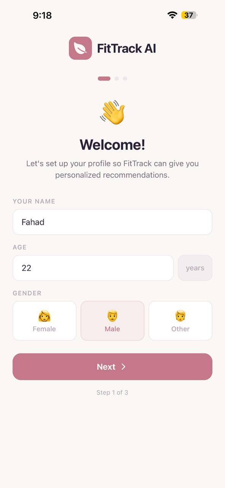 | 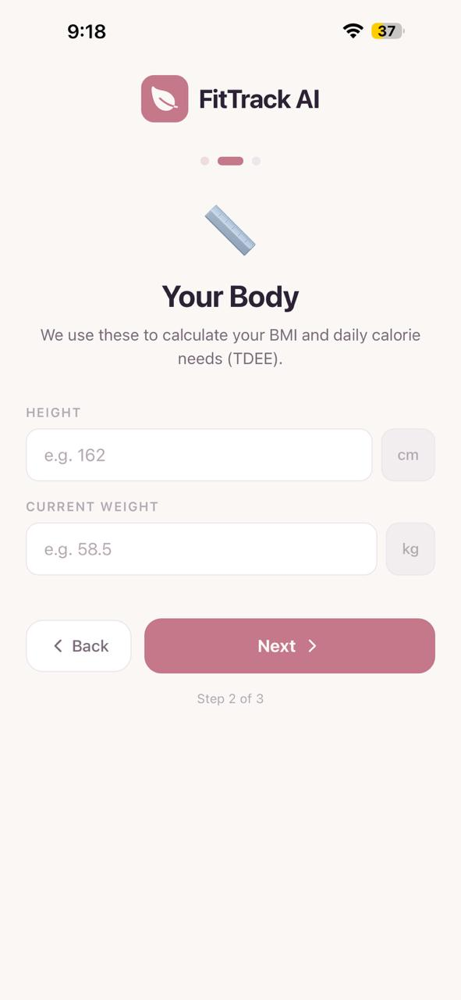 | 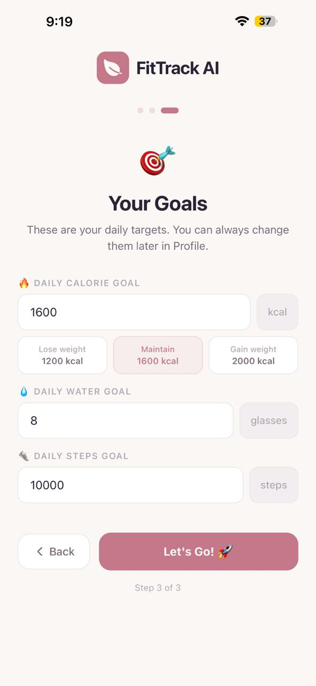 |

### Dashboard

| Home — Calorie Ring & Macros          | Home — Water & Steps                     |
| ------------------------------------- | ---------------------------------------- |
| 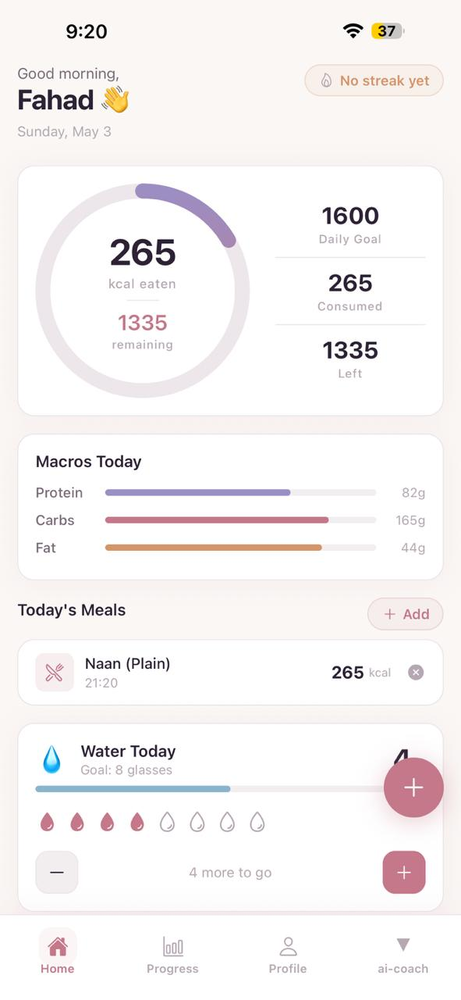 | 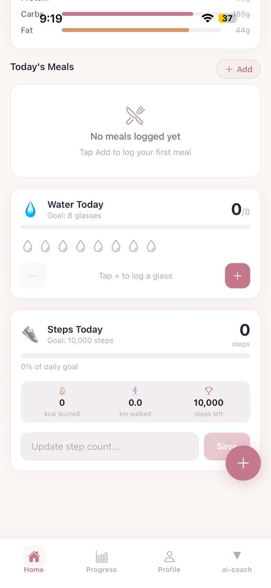 |

### Meal Logging

| Food Search & Browse                    | Food Selected                             |
| --------------------------------------- | ----------------------------------------- |
| 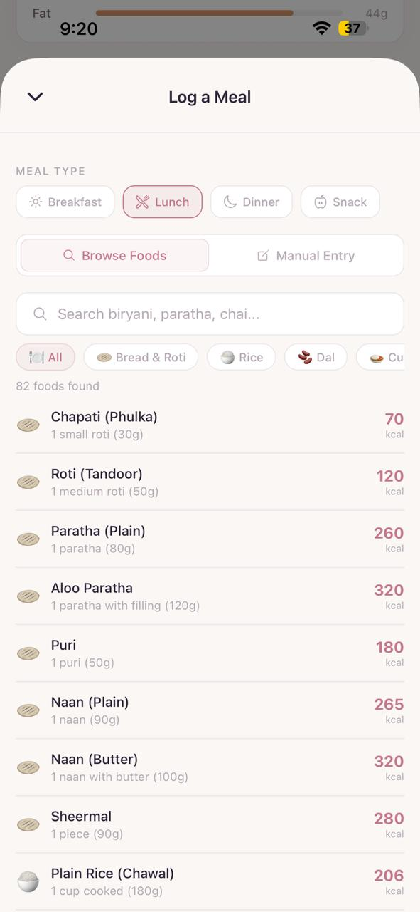 | 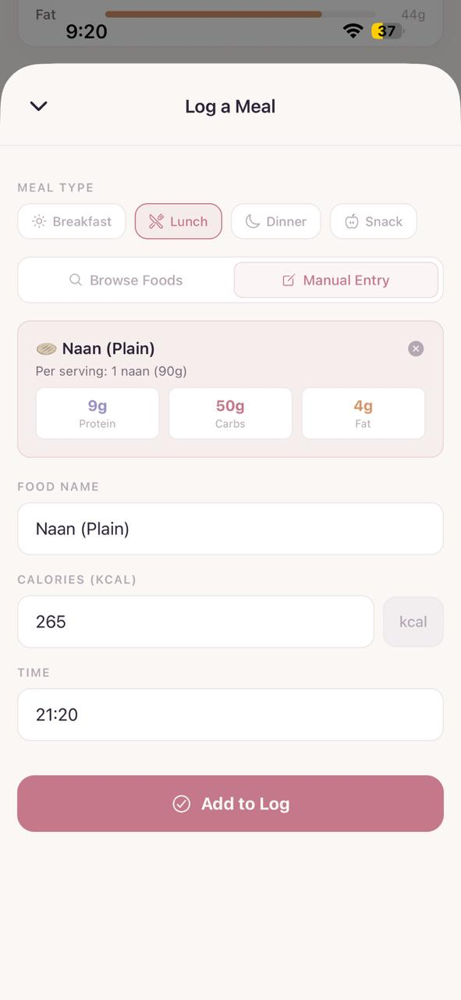 |

### Progress & Profile

| Progress & Charts                | Profile & BMI                   |
| -------------------------------- | ------------------------------- |
| 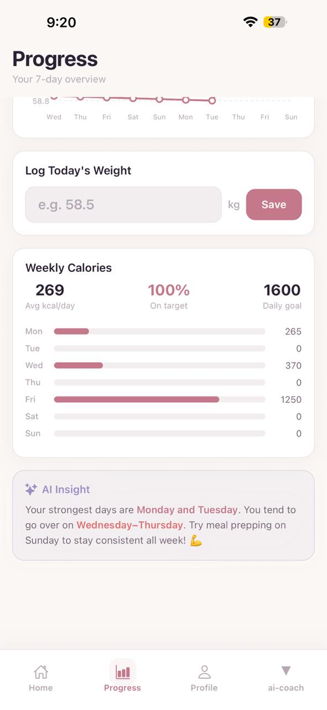 | 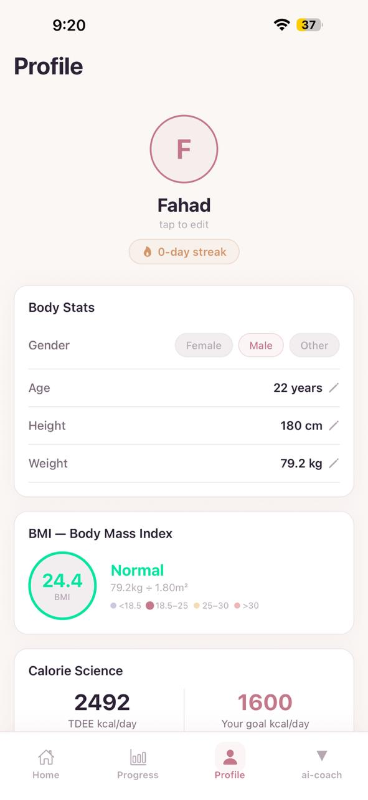 |

### AI Coach

| AI Coach — Quick Prompts           | AI Coach — Conversation            |
| ---------------------------------- | ---------------------------------- |
| 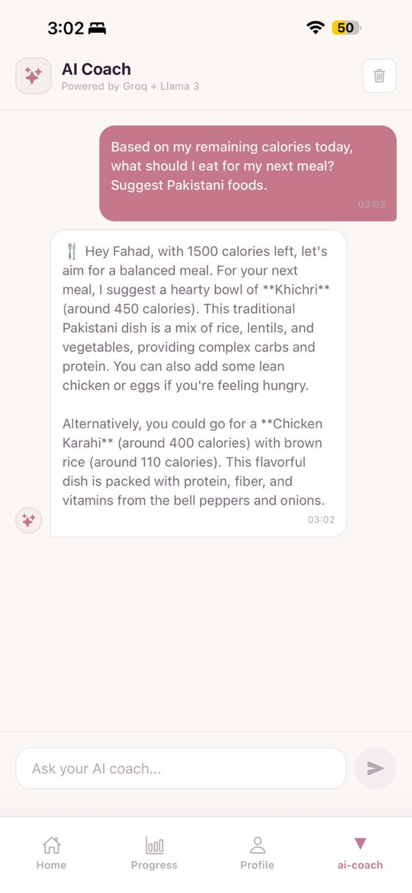 | 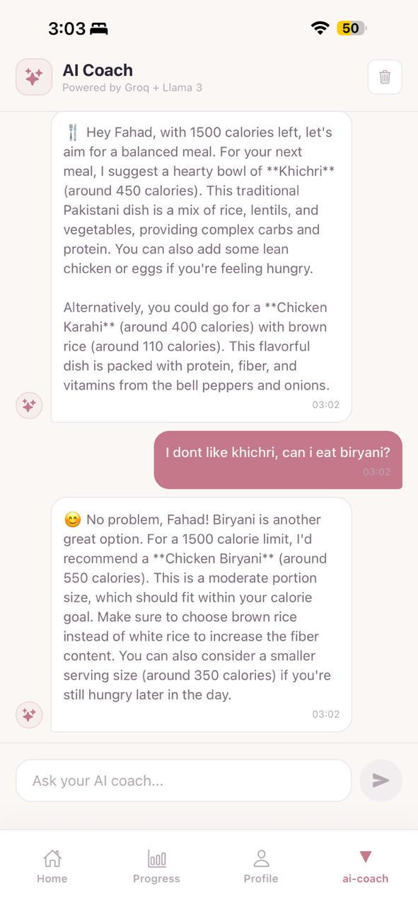 |

---

## Features

### Dashboard

- Animated SVG calorie progress ring
- Real-time macro tracking (protein, carbs, fat)
- Daily streak badge with color progression
- Recovery mode — smart tip when calorie goal exceeded
- Water intake tracker with visual glass indicators
- Steps tracker with distance + calorie burn estimates

### Meal Logging

- Search from 80+ Pakistani foods database with accurate calories
- Browse by category (Roti, Rice, Dal, Chicken, Snacks, etc.)
- Manual entry for custom foods
- Macronutrient breakdown per food item
- Quick category tagging (Breakfast / Lunch / Dinner / Snack)

### AI Coach (Powered by Google Gemini)

- Personalized advice using your real health data
- Quick prompts: meal suggestions, weekly analysis, meal plans
- Full conversation history within session
- Context-aware — AI knows your BMI, calories, streak, meals

### Progress Tracking

- 7-day weight trend chart (custom SVG, no library)
- Weekly calorie bar chart with goal comparison
- Consistency percentage and average calorie stats
- Smart AI insights about eating patterns

### Profile & Body Stats

- BMI calculator with color-coded health category
- TDEE (Total Daily Energy Expenditure) calculator
- Calorie deficit/surplus analysis with weekly projection
- Mifflin-St Jeor BMR formula for accuracy
- Achievement badges (On Fire, Week Win, Consistent, Dedicated)
- Editable goals — calories, water, steps

### Data Persistence

- Full offline support via AsyncStorage
- Data survives app close and reopen
- Automatic daily reset at midnight
- Streak calculation based on previous day's performance

---

## Tech Stack

| Category         | Technology                                     |
| ---------------- | ---------------------------------------------- |
| Framework        | React Native 0.74 + Expo SDK 51                |
| Language         | TypeScript                                     |
| Navigation       | Expo Router v3 (file-based routing)            |
| State Management | React Context + useReducer                     |
| Storage          | AsyncStorage (offline-first)                   |
| AI Integration   | Google Gemini API (gemini-3.1-flash-lite)      |
| Charts           | react-native-svg (custom, no charting library) |
| Icons            | @expo/vector-icons (Ionicons)                  |
| Date Handling    | Day.js                                         |

---

## Getting Started

### Prerequisites

- Node.js 18+
- Expo Go app on your phone
  ([iOS](https://apps.apple.com/app/expo-go/id982107779) /
  [Android](https://play.google.com/store/apps/details?id=host.exp.exponent))
- Free Google Gemini API key
  ([Get one here](https://aistudio.google.com))

### Installation

```bash
# Clone the repository
git clone https://github.com/IramBashir/fittrack-ai.git
cd fittrack-ai

# Install dependencies
npm install

# Set up environment variables
cp .env.example .env
# Add your Gemini API key to .env

# Start the development server
npx expo start
```

Scan the QR code with Expo Go on your phone.

### Environment Variables

```bash
# .env
EXPO_PUBLIC_GROQ_API_KEY=your_groq_api_key_here
```

Get your free Groq API key at
[console.groq.com](https://console.groq.com) —
no credit card required.

---

## Project Structure

```
fittrack-ai/
├── app/
│   ├── (tabs)/
│   │   ├── _layout.tsx
│   │   ├── index.tsx
│   │   ├── progress.tsx
│   │   ├── ai-coach.tsx
│   │   └── profile.tsx
│   ├── _layout.tsx
│   ├── index.tsx
│   ├── onboarding.tsx
│   └── add-meal.tsx
├── components/
│   ├── Card.tsx
│   ├── CalorieRing.tsx
│   ├── MealItem.tsx
│   ├── WaterTracker.tsx
│   └── StepsTracker.tsx
├── context/
│   └── AppContext.tsx
├── constants/
│   ├── theme.ts
│   └── pakistaniFoods.ts
├── screenshots/
├── .env.example
└── README.md
```

---

## Technical Highlights

**Custom SVG Charts** — Built weight trend and calorie
bar charts from scratch using react-native-svg without
any charting library. Handles dynamic scaling, gradient
fills, and axis labels.

**AI Context Injection** — Before every Gemini API call,
the app injects the user's real health data (BMI, calories,
meals, streak) into the system prompt. This makes responses
genuinely personalized rather than generic.

**Offline-First Architecture** — All data persists via
AsyncStorage with parallel read/write using Promise.all.
The app works fully offline — AI is the only feature
requiring internet.

**Automatic Daily Reset** — App compares today's date
with last opened date on every launch. If it's a new day,
daily trackers reset and streak is evaluated based on
yesterday's calorie performance.

**BMR/TDEE Calculation** — Implements the Mifflin-St Jeor
formula (most clinically accurate for general use) to
calculate basal metabolic rate, then applies an activity
multiplier for TDEE estimation.

## About The Developer

**Iram Bashir**
MSCS Student @ FAST NUCES Islamabad
Cybersecurity Minor | Software Engineer

- [LinkedIn](https://www.linkedin.com/in/iirambashir)
- [GitHub](https://github.com/IramBashir)
- 📧 → irambashir.dev@gmail.com

---

## License

MIT License — feel free to fork and build on this!

---

<div align="center">
  <i>Built with Love in Islamabad, Pakistan</i>
</div>
